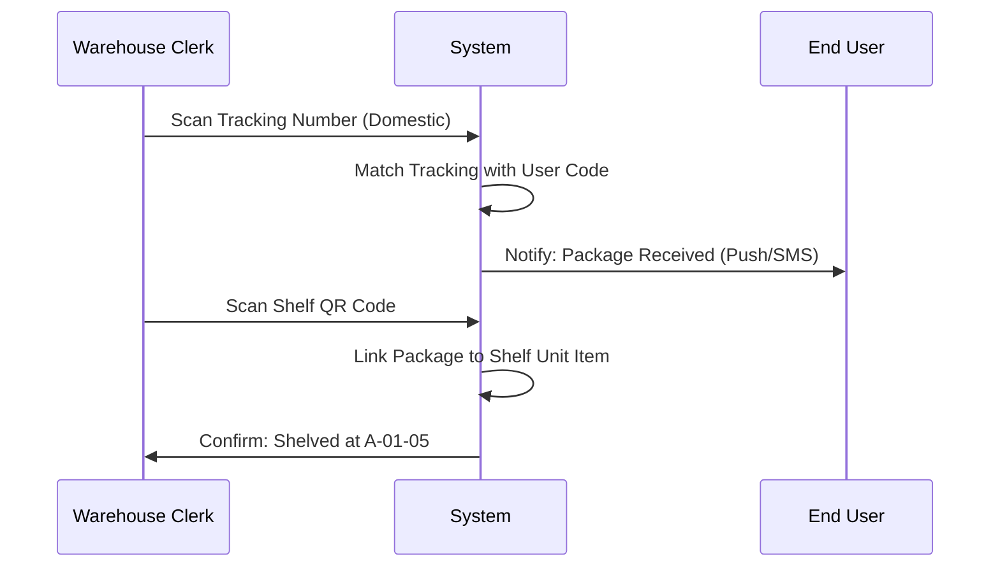
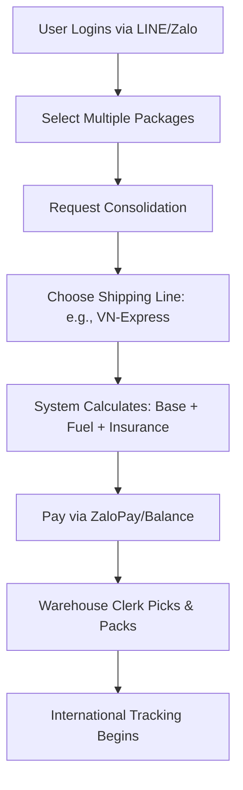
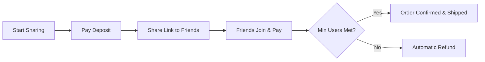

# Comprehensive Project Specification: Logistics & E-commerce SaaS Platform

## 1. Project Vision
This platform is a high-end, multi-tenant (SaaS) solution designed for **Cross-border Logistics** and **Social E-commerce**. It bridges the gap between international shipping consolidation and local marketplace interaction, supporting multiple platform integrations (WeChat, Zalo, LINE).

---

## 2. Technical Architecture & SaaS Model

### A. Multi-tenancy (SaaS)
The system follows a **Shared Database, Shared Schema** approach for multi-tenancy:
- **Tenant Identifier**: `wxapp_id` is the primary key for data isolation across almost all tables (orders, users, goods, settings).
- **Tenant Isolation**: Queries are globally scoped or explicitly filtered by `wxapp_id`.
- **SaaS Management**:
    - **Super Admin**: Creates and manages tenants (Stores), sets expiration dates (`end_time`), and manages global platform settings.
    - **Store Admin**: Manages tenant-specific configuration, branding, and operations.

### B. Core Technology Stack
- **Framework**: ThinkPHP (PHP 7+) - Standard MVC architecture.
- **Database**: MySQL with InnoDB, optimized for high concurrency and complex indexing.
- **Frontend**: Hybrid approach supporting WeChat Mini App, Zalo Mini App, and LINE LIFF.
- **Integrations**: ZaloPay, WeChat Pay, OmiPay, LINE OIDC, WeChat OAuth2.

---

## 3. Authentication & Authorization (AuthN & AuthZ)

### A. Authentication (Multi-platform)
The system supports a unified login flow across different platforms:
- **WeChat**: OAuth2 and Mini App login.
- **Zalo**: Mini App ID-based login.
- **LINE**: OpenID Connect (OIDC) with ID Token verification.
- **Mobile/Email**: Standard password and OTP-based authentication.

### B. Authorization (RBAC)
The system implements a granular **Role-Based Access Control** (RBAC) system:
1.  **Super Admin (Platform)**: Full access to system logs, tenant management, and global configurations.
2.  **Store Admin (Merchant)**: Access to all features within their specific `wxapp_id`.
3.  **Store Clerk (Warehouse/Staff)**: Access to operational modules like Inpack scanning, shelving, and picking.
4.  **Dealer (Distributor)**: Access to the referral dashboard, commission logs, and marketing materials.
5.  **User (Customer)**: Access to personal parcel management, shopping, and wallet.

---

## 4. Domain Models & Business Logic

### A. Logistics Domain (The Engine)
Handles the physical movement of goods.
- **`yoshop_inpack`**: Incoming parcels from domestic carriers.
- **`yoshop_package`**: User-owned parcels awaiting consolidation.
- **`yoshop_order`**: Final consolidated shipping orders.
- **`yoshop_line`**: Routes with custom pricing (Weight, Volume, Postcode zones).
- **`yoshop_shelf`**: Physical warehouse location management.

### B. E-commerce Domain (The Marketplace)
Drives sales and user engagement.
- **Goods**: Standard SKU management, specifications, and categories.
- **Social Marketing**:
    - **Sharing (Group Buy)**: Users invite others to lower the price.
    - **Bargaining**: Interactive price-slashing game.
    - **Blindbox**: Gamified product discovery.

### C. Finance Domain (The Ledger)
Ensures secure transactions.
- **Multi-wallet**: Balance (for shipping/purchases) and Points (for loyalty).
- **Payment Hooks**: Signature-verified webhooks for third-party payment providers.
- **Commission Engine**: Multi-level referral tracking for Dealers.

---

## 5. Detailed Use Case Flows

### Flow 1: Parcel Inbound & Shelving (Clerk Perspective)

### Flow 2: Consolidation & International Shipping (User Perspective)

### Flow 3: Social E-commerce (Sharing/Group Buy)

---

## 6. Data Schema - Core Entities (Attributes)

### User Table (`yoshop_user`)
| Attribute | Type | Description |
| :--- | :--- | :--- |
| `user_id` | INT (PK) | Unique ID |
| `user_code` | VARCHAR | Warehouse ID used by customers as address suffix |
| `balance` | DECIMAL | Current wallet balance |
| `dealer_id` | INT | Link to the referral parent |
| `wxapp_id` | INT | Tenant identifier |

### Shipping Order (`yoshop_order`)
| Attribute | Type | Description |
| :--- | :--- | :--- |
| `order_status` | TINYINT | 10: Processing, 20: Finished, 30: Cancelled |
| `pay_status` | TINYINT | 10: Unpaid, 20: Paid |
| `delivery_status` | TINYINT | 10: Not Shipped, 20: Shipped, 30: Received |
| `total_price` | DECIMAL | Base shipping + add-on services |

### Inpack Table (`yoshop_inpack`)
| Attribute | Type | Description |
| :--- | :--- | :--- |
| `status` | TINYINT | 1: Received, 2: Shelved, 3: Picking, 4: Packed, 5: Shipped |
| `is_exceed` | BOOL | True if package exceeds free storage period |

---

## 7. SaaS Implementation Details

### Tenant-Specific Settings
Configurations are stored in `yoshop_setting` and retrieved by `key` + `wxapp_id`:
- **Logistics Settings**: Volume-to-weight ratio, fuel surcharge percentage.
- **Marketing Settings**: Reward levels for Dealers.
- **Design Settings**: Home page layout (via `WxappPage` JSON).

### Tenant Onboarding
1.  **Super Admin** creates a record in `yoshop_wxapp`.
2.  Initial store settings are cloned from a template.
3.  Store Admin logs in and configures their API keys (LINE, ZaloPay, etc.).
4.  Store URL/Mini App is published with the corresponding `wxapp_id`.
